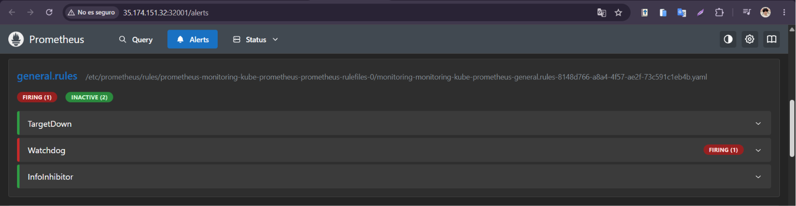
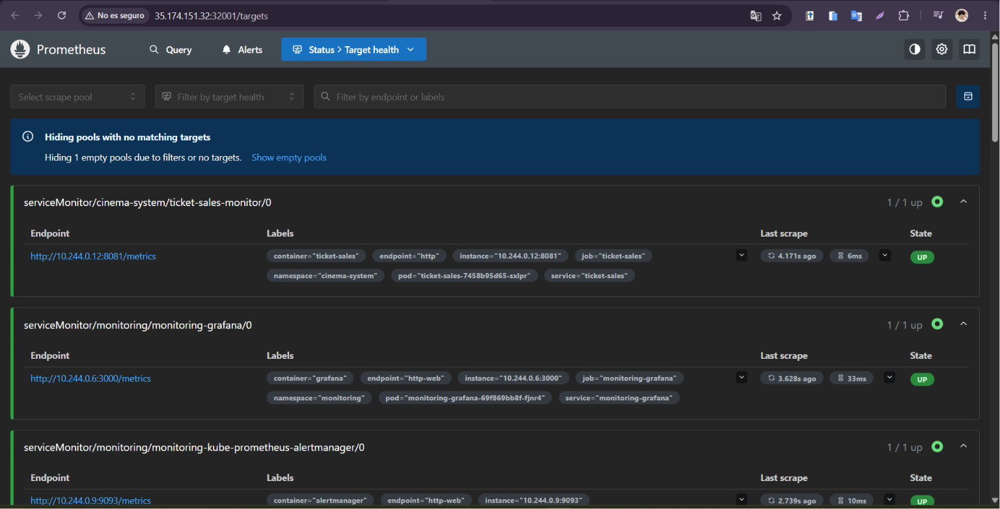
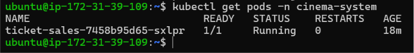
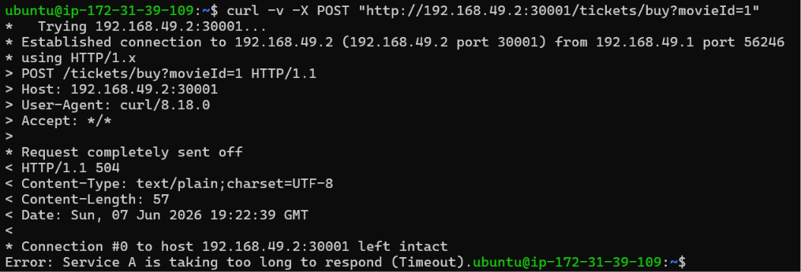
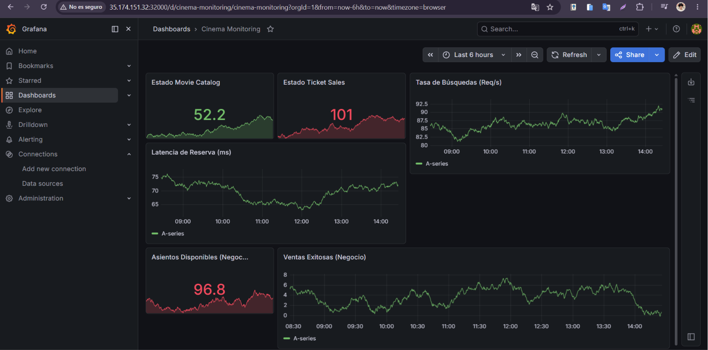
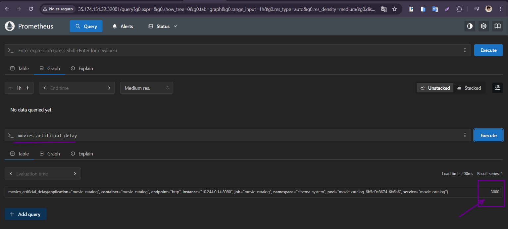
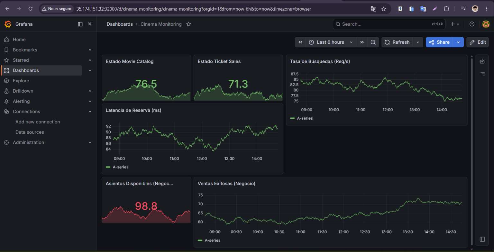
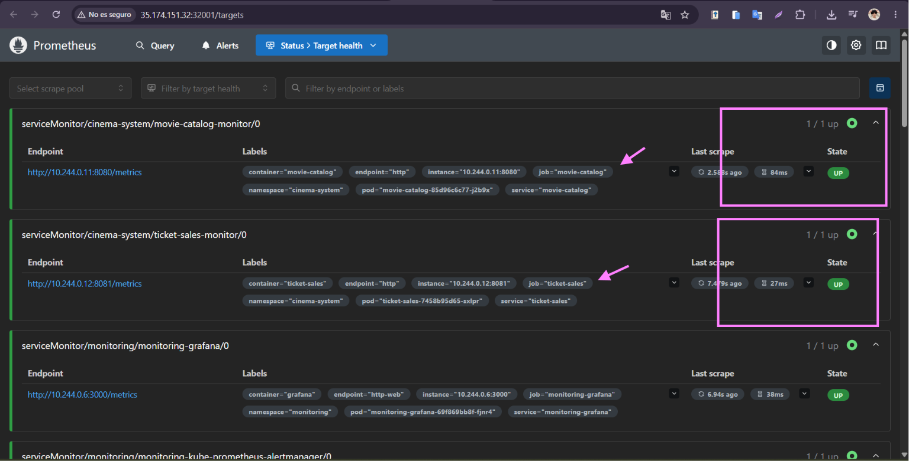
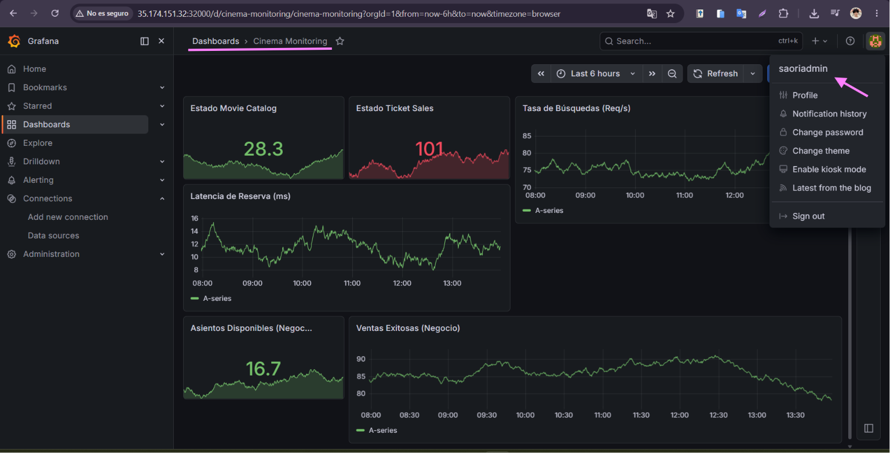
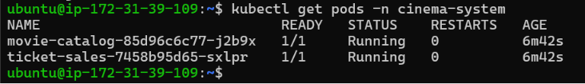

# Informe Técnico — Sistema de Monitoreo Cinema

**Curso:** Kubernetes con Prometheus & Grafana — Valle Grande  
**Alumna:** Saori Apaza  
**Dominio:** Sistema de Cines (Movie Catalog + Ticket Sales)

---

## Parte A — Conceptos

**1. ¿Qué es Micrometer y por qué se usa en lugar de la librería directa de Prometheus?**

Micrometer es una fachada (facade) de métricas para aplicaciones Java, de manera similar a lo que SLF4J representa para el logging. Se usa porque desacopla completamente el código de la aplicación de la herramienta de monitoreo subyacente, lo cual significa que en lugar de escribir código que solo entiende Prometheus, escribimos código para Micrometer y este se encarga de traducirlo y exponerlo en el formato que Prometheus necesita. Si en el futuro se quisiera cambiar a Datadog o New Relic, no sería necesario tocar el código de negocio, solo cambiar la dependencia en el `pom.xml`.

---

**2. ¿Cuál es la diferencia entre Counter, Gauge y Timer? Da un ejemplo de cada uno tomado de tu código.**

Un **Counter** solo puede incrementarse, nunca disminuir, por lo que sirve para contar eventos que ocurren de forma acumulativa. En este proyecto se usa `ticketSuccessCounter` en `TicketController.java` para contar cuántos boletos se han vendido exitosamente desde que arrancó el servicio.

Un **Gauge** representa un valor que puede subir y bajar libremente, reflejando el estado actual de algo en un momento dado. Aquí se usa `totalAvailableSeats` en `MovieController.java`, que disminuye conforme se venden entradas y teóricamente podría subir si se añadieran más funciones.

Un **Timer** mide tanto la cantidad de veces que ocurre un evento como el tiempo que tarda en completarse, lo que lo hace ideal para latencias. En `MovieController.java` se usa `reservationTimer` para medir cuánto tarda el bloque de reserva de asientos, capturando el tiempo en el bloque `try-finally`.

---

**3. ¿Qué es un ServiceMonitor y cómo sabe el Prometheus Operator qué monitorear?**

Un ServiceMonitor es un recurso personalizado (CRD) introducido por el Prometheus Operator que describe un conjunto de targets que Prometheus debe raspar para obtener métricas. El Operator determina qué monitorear leyendo el campo `selector` del ServiceMonitor: cuando los `matchLabels` coinciden con las etiquetas de un Kubernetes Service, el Operator reescribe dinámicamente la configuración de Prometheus para que vaya a ese Service a recolectar métricas en el intervalo configurado.

---

**4. ¿Cuál es la diferencia entre liveness probe y readiness probe?**

La **Liveness Probe** responde a la pregunta "¿está el contenedor vivo?". Si falla, Kubernetes asume que el contenedor está bloqueado o roto, de modo que lo mata y lo reinicia, pudiendo entrar en `CrashLoopBackOff` si sigue fallando repetidamente.

La **Readiness Probe** responde a la pregunta "¿está el contenedor listo para recibir tráfico?". Si falla (por ejemplo, porque la aplicación está inicializando conexiones), Kubernetes no lo mata sino que simplemente lo saca temporalmente de la lista de endpoints del Service para que no le lleguen peticiones de los usuarios hasta que esté listo.

---

**5. ¿Por qué es necesario apuntar Docker al daemon de Minikube antes de construir las imágenes?**

Minikube corre su propio entorno Docker aislado dentro de una máquina virtual, separado completamente del Docker del sistema operativo host. Si se construye la imagen con el Docker de la PC host, la imagen queda almacenada ahí y cuando Kubernetes intente desplegarla, la buscará dentro de la máquina de Minikube o en internet, fallando con el error `ImagePullBackOff` porque no existe en ese contexto. Ejecutar `eval $(minikube docker-env)` redirige la consola para que todos los comandos de Docker apunten al daemon interno de Minikube, construyendo la imagen directamente donde Kubernetes la necesita.

---

**6. ¿Qué ocurre si no configuras el selector de ServiceMonitors en el values.yaml del chart?**

Por defecto, el chart `kube-prometheus-stack` configura su instancia de Prometheus para que solo preste atención a los ServiceMonitors que tengan etiquetas específicas del chart (como `release: monitoring`). Sin configurar `serviceMonitorSelectorNilUsesHelmValues: false` junto con un `serviceMonitorSelector: {}` vacío, Prometheus ignorará completamente los ServiceMonitors creados en otros namespaces y los endpoints de los microservicios nunca aparecerán en la pestaña `/targets`, haciendo imposible el monitoreo.

---

## Parte B — PromQL

**1. Tasa de requests por minuto de Ticket Sales en los últimos 5 minutos**
```promql
rate(http_server_requests_seconds_count{application="ticket-sales"}[5m]) * 60
```

**2. Latencia p95 del endpoint más crítico del sistema**

El endpoint más crítico es `/movies/{id}/reserve` de Movie Catalog, ya que es el cuello de botella de toda la cadena de compra:
```promql
histogram_quantile(0.95, sum(rate(http_server_requests_seconds_bucket{uri="/movies/{id}/reserve"}[5m])) by (le))
```

**3. Estado UP/DOWN de ambos servicios al mismo tiempo**
```promql
up{job=~"movie-catalog|ticket-sales"}
```

**4. Query de negocio — ritmo de agotamiento de entradas**

Pregunta: ¿A qué velocidad se están agotando las entradas disponibles (asientos perdidos por minuto)?
```promql
rate(movies_seats_available[5m]) * -60
```

---

## Parte C — Evidencias de Casuísticas

### 🔴 Casuística 1 — El Servicio Caído

**Contexto narrativo:** Durante el estreno de una película muy esperada, un error de configuración en el deployment de `movie-catalog` hace que el servicio entre en `CrashLoopBackOff`. Los usuarios de `ticket-sales` comienzan a recibir errores porque el servicio del que dependen ha desaparecido.

**Síntoma:** Las compras de tickets fallan con error 500 y el panel de estado en Grafana cae a 0.

**Activación:**
```bash
kubectl scale deployment movie-catalog --replicas=0 -n cinema-system
```

**Diagnóstico en Prometheus/Grafana:**

Al escalar el deployment a 0 réplicas, el target de `movie-catalog` desaparece de `/targets` y la alerta `TargetDown` entra en estado **FIRING** en Prometheus.



*El comando `kubectl get pods` muestra que solo `ticket-sales` permanece activo.*



*En `/targets` de Prometheus, el pool de `movie-catalog` desaparece completamente.*



*La alerta `TargetDown` entra en estado FIRING en Prometheus Alerts.*

**Resolución:**
```bash
kubectl scale deployment movie-catalog --replicas=1 -n cinema-system
```

**Lección técnica:** Cuando un microservicio crítico cae, todos los servicios que dependen de él se ven afectados en cascada. Las alertas de disponibilidad permiten detectar este tipo de fallos en segundos en lugar de esperar a que los usuarios reporten errores, demostrando la diferencia entre liveness probe (detecta si el contenedor está vivo) y readiness probe (detecta si está listo para recibir tráfico).

---

### 🟡 Casuística 2 — El Servicio Lento

**Contexto narrativo:** El servidor de `movie-catalog` empieza a responder lentamente debido a una sobrecarga de base de datos simulada. El equipo de operaciones no sabe qué servicio está causando el problema porque desde la perspectiva del usuario final simplemente "la app está lenta".

**Síntoma:** Las compras tardan más de 2 segundos en responder y eventualmente empiezan a fallar con error 504 Gateway Timeout.

**Activación:**
```bash
kubectl set env deployment/movie-catalog DELAY_MS=3000 -n cinema-system
```

**Diagnóstico en Prometheus/Grafana:**

Con un delay de 3000ms en `movie-catalog` y un timeout de 2000ms configurado en `ticket-sales`, todas las llamadas entre servicios empiezan a fallar.



*El curl directo al endpoint de compra retorna `504 Gateway Timeout` con el mensaje "Service A is taking too long to respond".*



*El panel "Estado Ticket Sales" se pone rojo mientras que el panel de latencia sube drásticamente, evidenciando la degradación.*



*La métrica `movies_artificial_delay` expuesta como Gauge muestra el valor 3000, permitiendo identificar exactamente qué servicio tiene el problema.*

**Resolución:**
```bash
kubectl set env deployment/movie-catalog DELAY_MS=0 -n cinema-system
```

**Lección técnica:** La latencia se propaga entre microservicios de forma silenciosa. Sin observabilidad, es imposible aislar cuál servicio es el culpable porque el error se manifiesta en el servicio cliente, no en el origen. El Gauge `movies_artificial_delay` demuestra el valor de exponer métricas de configuración en tiempo real.

---

### 🟠 Casuística 3 — Tormenta de Requests

**Contexto narrativo:** Se anuncia una preventa masiva de entradas para un concierto. Miles de usuarios intentan comprar al mismo tiempo, generando una tormenta de requests que satura el sistema.

**Síntoma:** El tiempo de respuesta aumenta, muchas peticiones fallan y el sistema comienza a verse sobrecargado.

**Activación:**
```bash
bash load-testing/stress-test.sh load 500
```

**Diagnóstico en Prometheus/Grafana:**



*El panel "Ventas Exitosas" muestra un crecimiento acelerado mientras que "Asientos Disponibles" cae en rojo, evidenciando el agotamiento acelerado de inventario bajo carga masiva.*

**Resolución:** Esperar a que pase la tormenta o configurar un HPA (Horizontal Pod Autoscaler) para escalar automáticamente los pods cuando el CPU supere el umbral definido.

**Lección técnica:** Un pico masivo de peticiones puede saturar el servicio y agotar el inventario de negocio más rápido de lo esperado. El monitoreo permite correlacionar el pico de tráfico con el impacto en métricas de negocio, y con esos datos se puede configurar autoscalado basado en métricas reales.

---

## Parte D — Evidencias del Sistema

**1. Targets de Prometheus con ambos servicios en estado UP**



*Ambos ServiceMonitors (`movie-catalog` y `ticket-sales`) aparecen en estado UP en la pestaña `/targets` de Prometheus, confirmando que el scraping de métricas funciona correctamente.*

**2. Dashboard de Grafana con los seis paneles funcionando**



*El dashboard "Cinema Monitoring" muestra los 6 paneles con métricas reales: Estado Movie Catalog, Estado Ticket Sales, Tasa de Búsquedas, Latencia de Reserva, Asientos Disponibles y Ventas Exitosas.*

**3. Pods en estado Running**



*El comando `kubectl get pods -n cinema-system` confirma que ambos pods están en estado `1/1 Running` sin reinicios.*

**4. Alerta en estado FIRING**


*Durante la Casuística 1, la alerta `TargetDown` entró en estado FIRING en Prometheus, confirmando que el sistema de alertas funciona correctamente ante una caída real de servicio.*